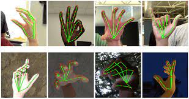

# Hand-Tracking

#### In the field of gesture recognition and image processing, finger tracking is a high-resolution technique developed in 1969 that is employed to know the consecutive position of the fingers of the user and hence represent objects in 3D.

---



---

* Clone this repository in your local environment by running the code on your bash.
  

`git clone https://github.com/YOUR-USERNAME/Face-Detection.git`

Now, install the required **packages:**


* `pip install opencv-python` 

OpenCV is a library of programming functions mainly aimed at real-time computer vision. Originally developed by Intel, it was later supported by Willow Garage then Itseez. The library is cross-platform and free for use under the open-source Apache 2 License.

Usage:

* To access your webcam through opencv

```python
import cv2

cap = cv2.VideoCapture(0)

while True:
    success, vid = cap.read()
    cv2.imshow("Video", vid)
    cv2.waitKey(1)
```

* To show fps count on the screen

```python
import time
import cv2 as cv

pTime = 0
cTime = time.time()
fps = 1 / (cTime - pTime)
pTime = cTime
cv.putText(flipped, f'FPS:{int(fps)}', (10, 70),
               cv.FONT_HERSHEY_PLAIN, 3, (0, 255, 0), 2)
```


* `pip install mediapipe`


MediaPipe Hands is a high-fidelity hand and finger tracking solution. It employs machine learning (ML) to infer 21 3D landmarks of a hand from just a single frame. Whereas current state-of-the-art approaches rely primarily on powerful desktop environments for inference, our method achieves real-time performance on a mobile phone, and even scales to multiple hands. We hope that providing this hand perception functionality to the wider research and development community will result in an emergence of creative use cases, stimulating new applications and new research avenues.